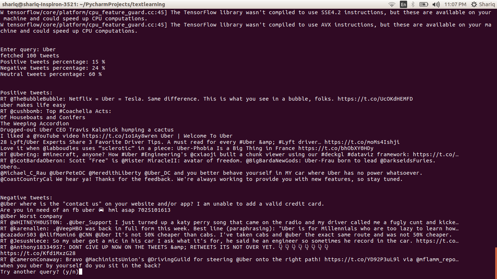
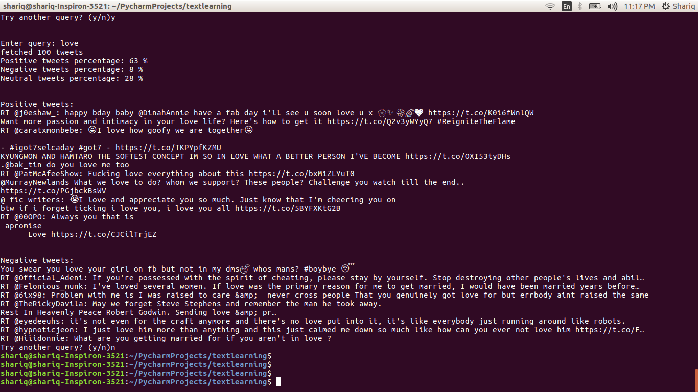

# twitter_sentiment
Twitter Sentiment classification using Deep Learning.
A classic example of application of deep learning in Natural Language Processing.

# Usage
Run twitter.py file which provides a Command Line Interface for sentiment classification on any query on Twitter:

```
python twitter.py

```

# Example Screenshots
Lets see what twitter has to say about Uber (Not meant for any offence against any person or entity)
```
python twitter.py
Enter query: Uber
```


Lets try what world thinks about "Love"

```
python twitter.py
Enter query: love
```


Queries can be of arbitrary length (only limited by twitter). You can think of twitter.py as a wrapper interface to twitter search engine that returns the percentage of positive, negative and neutral tweets about the query.

# Future of project
I'm thinking of developing a web api and a web interface for the twitter sentiment classification.
